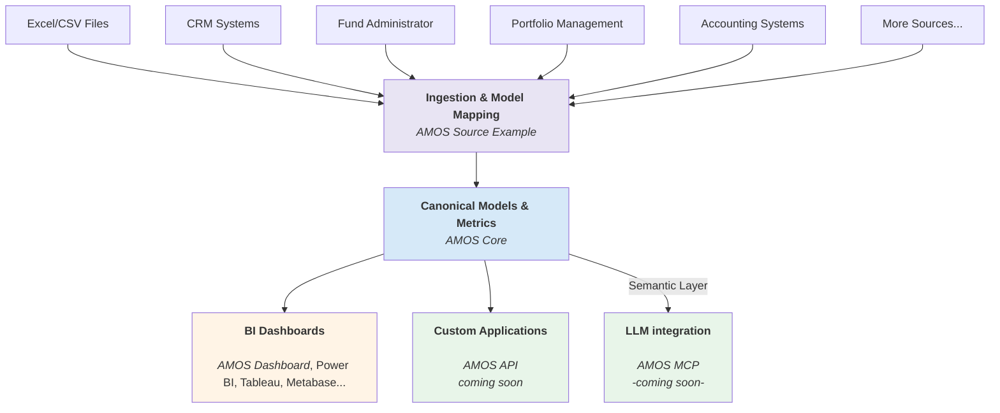

**AMOS** | [Core](https://github.com/open-amos/core) | [Reconciliation](https://github.com/open-amos/reconciliation) | [Dashboard](https://github.com/open-amos/dashboard) | [Source Example](https://github.com/open-amos/source-example)

---

# AMOS

**The open-source data infrastructure for private market funds.**

AMOS replaces spreadsheet chaos with a modern data stack. It connects your existing systems into a unified SQL warehouse, giving you a reliable foundation to automate reporting and deploy AI without vendor lock-in.

 
    

---

## Who It’s For

  - **Emerging funds** looking for a lightweight but robust data foundation to support efficient operations and AI-readiness from day one.
  - **Established funds** seeking to modernize legacy systems and simplify complex data architectures without vendor lock-in.

## Quick Start

The fastest way to spin up the full stack is via Docker.

```bash
# 1. Clone the repo
git clone [https://github.com/open-amos/amos.git](https://github.com/open-amos/amos.git)
cd amos

# 2. Launch the stack
docker-compose up -d

# 3. Access the UI
# Dashboard: http://localhost:3000
# Database: localhost:5432
```

If you prefer to run this in your own environment without Docker:

1.  Install [dbt-core and dbt-postgres](https://docs.getdbt.com/docs/get-started-dbt) or any other adapter. AMOS works with any database engine supported by dbt, including PostgreSQL, MySQL, Microsoft SQL Server, Snowflake, Google BigQuery, Amazon Redshift, Databricks, and more.
2.  Configure your database connections in `profiles.yml`
3.  Run `dbt deps` to install dependencies (amos-core and amos-source-example)
4.  Run `dbt seed` to load example data
5.  Run `dbt run` to build the warehouse
6.  Run `dbt test` to validate metrics

## Project Components

This repository (`amos`) acts as the orchestrator. The logic is modularized across the following repos:

| Repository | Purpose | Who is this for? |
| :--- | :--- | :--- |
| **[AMOS Core](https://github.com/open-amos/core)** | **The Brain.** The dbt models and SQL logic that power the platform. | Data Engineers extending the logic. |
| **[AMOS Reconciliation](https://github.com/open-amos/reconciliation)** <br/>*(Coming Soon)* | **The Glue.** A UI for mapping entities (e.g., "Seq" = "Sequoia") and resolving data conflicts across systems. | Data Stewards & Ops Teams. |
| **[AMOS Dashboard](https://github.com/open-amos/dashboard)** | **The UI.** A reference implementation of a BI dashboard for private markets. | Frontend devs & UI customizers. |
| **[AMOS Source Example](https://github.com/open-amos/source-example)** | **The Template.** Example data loaders and transformation patterns. | Engineers building new integrations. |

## System Architecture



## Demo

Explore a live dashboard built on top of the AMOS architecture.
[**→ View live demo**](https://demo.amos.tech)


## Current Scope

AMOS currently supports core private market workflows:

  - **Canonical Models:** Private Equity & Private Credit.
  - **Integration Patterns:** Deal Pipeline, Portfolio Management, Fund Admin, and Accounting.

## Roadmap

AMOS is evolving toward broader coverage. Upcoming milestones:

  - 🤝 **Visual Reconciliation:** A dedicated app to map entities and resolve data conflicts across systems without writing SQL.
  - 🤖 **AI-Assisted Mapping:** "Human-in-the-loop" suggestions for mapping messy entity names (e.g., matching "Google Inc" to "Alphabet").
  - 🟢 **Impact & ESG:** Standardized models for impact measurement.
  - 🔌 **Rest API:** Public API for programmatic access to metrics.
  - 🤖 **MCP Server:** Native integration for AI assistants (Claude/ChatGPT) to query your data.
  - 📊 **Utility Apps:** Tools for automated PDF data extraction.

## Extensibility

AMOS is built to be extended:

  * **Connect real data:** Swap the `Source Example` for your own custom dbt models connecting to raw data.
  * **Extend the logic:** Import `amos-core` as a package and build your own marts on top of it.

## Licensing

AMOS is currently in **Public Beta**. Each subproject README describes temporary licensing terms. Final open-source or source-available licenses will be finalized before the 1.0 release.
